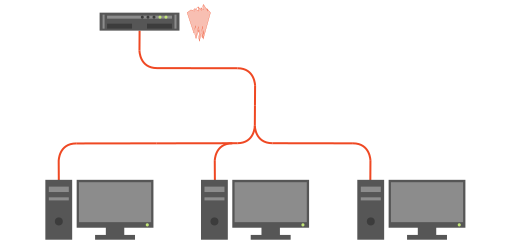
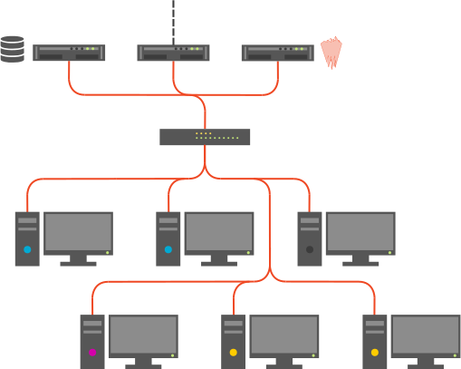

# Before installation

This guide will help you setup and deploy a standard Banquise, to manage an IT infrastructure.

Please note that during this process, some terminology will be used:

* **A node** is an entity hosting software resources. It can be anything: an hardware server, a workstation, a laptop, a node, a container, etc.
* **A server** will always refer to the software server terminology: a software that listen and manage clients.
* **An OS** is an Operating System.
* **The Saltmaster** is the node hosting the saltmaster server.

This guide will help you install Banquise step by step.

We will be using the reference infrastructure example provided:

- 1 x management also doing saltmaster
- 3 x nodes (generic workstations for example)

And by then modifying files step by step to move it to the following infrastructure:

- 1 x external saltmaster
- 1 x management with an external access as gateway
- 1 x storage (exporting /home)
- 1 x switch
- 6 x workstations with
    - Manufacturer A
        - 2 x workstations of model AA (Ubuntu)
        - 1 x workstation of model AB (Fedora)
    - Manufacturer B
        - 1 x workstations of model BA (Centos)
        - 2 x workstation of model BB (Centos)

Note that all infrastructure nodes like the saltmaster, the management or the storage will all be using Centos Linux.

If you encounter issues, do not hesitate to check the debug part of the documentation.
